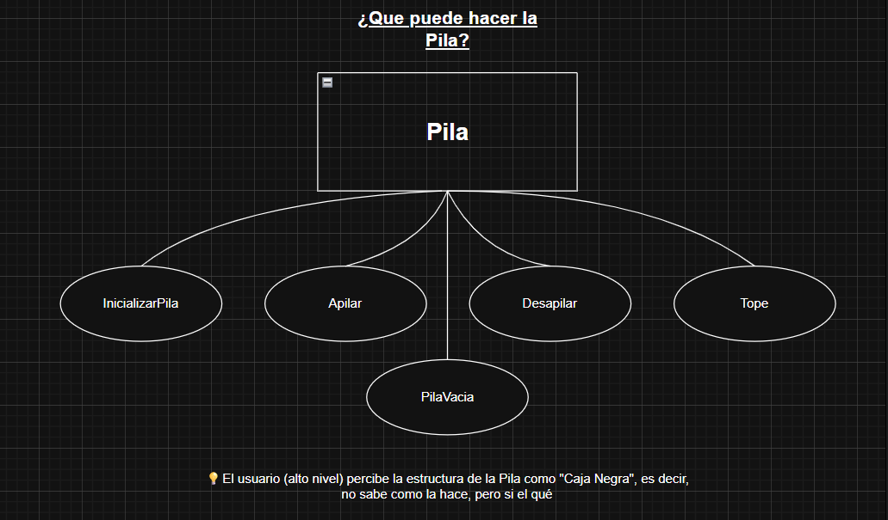
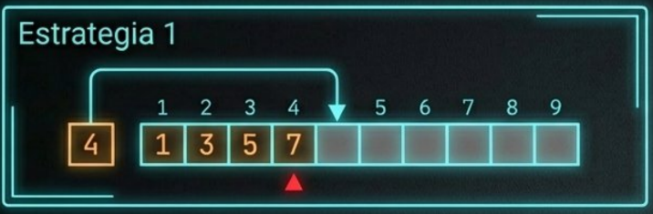
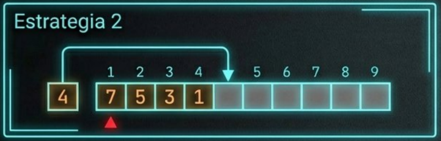
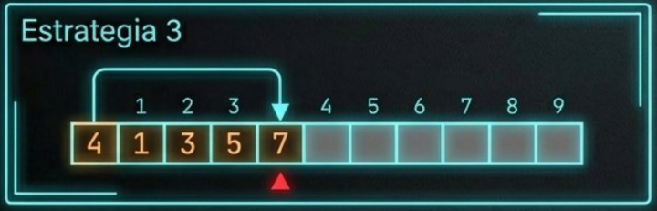

📌 PROGRAMACIÓN II

## 📖 Descripción
Este proyecto tiene como objetivo desarrollar y resolver las actividades propuestas en la materia **Programación II**, aplicando conceptos de estructuras de datos, abstracción y buenas prácticas de programación.

---

## 👥 Integrantes del equipo

  <b>Juan Cruz Rocca</b>  
   
  Estudiante de Ingeniería en Informática con interés en el desarrollo de software y estructuras de datos.

---

  <b>Nicolás Fresca</b>  
   
  Estudiante con conocimientos en Java, estructuras de datos y optimización de código.

---

  <b>Facundo Burguez</b>  
   
  Enfoque en lógica de programación y desarrollo de funcionalidades.

---

  <b>Tomás Lihuel Rodríguez Fernández Otero</b>  
   
  Interés en diseño de soluciones y modelado de sistemas.

---

  <b>Darío Gomez</b>  
   
  Enfocado en implementación y validación de soluciones.

---

  <b>Vacante</b>  
   
  Espacio disponible para un futuro integrante.

---

## ⚙️ Tecnologías utilizadas
- Java
- Programación orientada a objetos
- Git / GitHub
---

## 🎯 Objetivo
Desarrollar implementaciones eficientes y correctas de las actividades propuestas, respetando los conceptos teóricos de la materia y fomentando el trabajo en equipo.

---

# 🛠️ Desarrollo

## Actividad 1 clase 2 - 19/03/26

 

## Actividad 2 clase 2 - 19/03/26

Estrategia 1: Se reserva una variable auxiliar que puede utilizarse con 2 fines diferentes. Puede almacenar la cantidad (tamaño) del arreglo o el valor del tope (último valor en orden). Aquí cada dato que se añade se coloca en la posicion siguiente a la del tope actual, convirtiendose el nuevo valor en el tope, sin necesidad de mover los demás elementos. 

p 

 

Estrategia 2: Aquí se útiliza también una variable auxiliar, pero en este caso solo tiene un fin, almacenar el tamaño del arreglo. En esta estrategia los datos van en orden contrario, es decir, el tope es el primer elemento, y nunca varía en posición. Esto quiere decir que cada vez que se añade un dato, se coloca en la primera posición, y el resto de los datos se mueven una posición, lo que lo hace muy costoso en términos de rendimiento. 

 

Estrategia 3: Está es la única que no necesita de una variable auxiliar. Se reserva la primer posición para almacenar el valor del tamaño del arreglo, mientras que el resto de posiciones funcionan igual que en la estrategia 1. 

 

